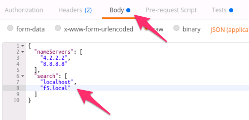
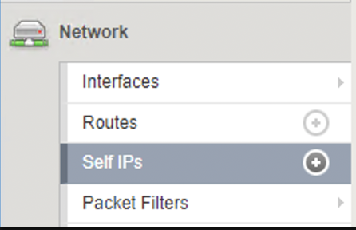

Lab 1.3: Review/Set Device Settings & Basic Network Connectivity
-----------------------------------

The BIG-IP device has been licensed with all appropriate modules provisioned.  For this lab, we will focus on configuring the necessary infrastructure related settings to complete the Device Onboarding process. The remaining items include (list not exhaustive):

-  Device Settings

   -  **NTP/DNS Settings**

   -  Remote Authentication

   -  **Hostname**

   -  **Admin Credentials**

-  L1-3 Networking

   -  Physical Interface Settings

   -  L2 Connectivity (**VLAN**, VXLAN, etc.)

   -  L3 Connectivity (**Self IPs, Routing**, etc.)

   The following table and diagram lists the L2-3 network information used to configure connectivity for BIG-IP A:

   .. list-table::
      :stub-columns: 1
      :header-rows: 1

      * - **Type**
        - **Name**
        - **Details**
      * - VLAN
        - External
        - **Interface**: 1.1

          **Tag:** 10

      * - VLAN
        - Internal
        - **Interface**: 1.2

          **Tag:** 20

      * - Self IP
        - Self-External
        - **Address**: 10.1.10.7/24

          **VLAN:** External

      * - Self IP
        - Self-Internal
        - **Address**: 10.1.20.7/24

          **VLAN:** Internal
      * - Route
        - Default
        - **Network:** 0.0.0.0/0

          **GW:** 10.1.10.1

Task 1 - Set Device Hostname & Disable GUI Setup Wizard
~~~~~~~~~~~~~~~~~~~~~~~~~~~~~~~~~~~~~~~~~~~~~~~~~~~~~~~

In this task, we will modify the device hostname and disable the GUI
Setup Wizard. The Resource that contains these settings is
``/mgmt/tm/sys/global-settings``.

Perform the following steps to complete this task:

#. Expand the ``Lab 1.3 - Review/Set Device Settings`` folder in the Postman collection.

#. Click the ``Step 1: Get System Global-Settings`` request. Click the :guilabel:`Send` button and review the response :guilabel:`Body` to see what the current settings on the device are. Examine the resulting response to understand what settings are currently applied.

#. Click the ``Step 2: Set System Global-Settings`` request. This item uses a ``PATCH`` request to the ``global-settings`` resource to modify the attributes contained within it. We will update the ``guiSetup`` and ``hostname`` attribute.

   - Click on :guilabel:`Body`. Review the JSON body and modify the ``hostname`` attribute to set the hostname to ``bigip-a.f5.local``

   - Also notice that we are disabling the GUI Setup Wizard as part of the same request:

     |lab-3-1|

#. Click the :guilabel:`Send` button and review the response :guilabel:`Body`. You should see that the attributes modified above have been updated by looking at the response. You can also ``GET`` the ``global-settings`` by sending the ``Step 1: Get System Global-Settings`` request again to verify they have been updated.

#. Click the ``Step 3: Set System System Device Name`` request. This item uses a ``POST`` request to the ``BASH utility`` resource to modify the attributes contained within it. This step is needed to set the device name in the DSC cluster

Task 2 - Modify DNS/NTP Settings
~~~~~~~~~~~~~~~~~~~~~~~~~~~~~~~~

.. NOTE:: This task will make use of JSON arrays.  The syntax for defining a JSON array is:

   ``myArray: [ Object0, Object1 ... ObjectX ]``

   To define an array consisting of Strings the syntax is:

   ``myStringArray: [ "string0", "string1" ... "stringX" ]``

Much like the previous task, we can update system DNS and NTP settings by sending a PATCH request to the correct resource in the ``sys`` Organizing Collection. The relevant Resources for this task are:

.. list-table::
   :header-rows: 1

   * - **URL**
     - **Type**
   * - ``/mgmt/tm/sys/dns``
     - DNS Settings
   * - ``/mgmt/tm/sys/ntp``
     - NTP Settings

Perform the following steps to complete this task:

#. Click the ``Step 4: Get System DNS Settings`` item in the folder. Click :guilabel:`Send` and review the current settings.

#. Click the ``Step 5: Set System DNS Settings`` item in the folder. Click :guilabel:`Body`. Review the JSON body to verify the name server IPs ``4.2.2.2`` and ``8.8.8.8`` are listed. Additionally, add a search domain of ``f5.local``. You will modify a JSON array to add a search domain:

   |lab-3-4|

#. Click the :guilabel:`Send` button and verify the requested changes were successfully implemented by looking at the response or by sending the ``Step 3: Get System DNS Settings`` request again.

#. Click the ``Step 6: Get System NTP Settings`` item in the folder. Click :guilabel:`Send` and review the current settings.

#. Click the ``Step 7: Set System NTP Settings`` item in the folder. Click :guilabel:`Body`. Review the JSON body to verify the NTP servers with hostnames ``0.pool.ntp.org`` and ``1.pool.ntp.org`` are contained in the ``servers`` attribute (another JSON array!).

#. Click the :guilabel:`Send` button and verify the requested changes were successfully implemented by looking at the response or sending the ``Step 6: Get System NTP Settings`` again.

Task 3 - Create VLANs
~~~~~~~~~~~~~~~~~~~~~

.. NOTE:: This lab shows how to configure VLAN tags, but does not deploy tagged interfaces.  To use tagged interfaces, the ``tagged`` attribute needs to have the value ``true``.

Perform the following steps to configure the VLAN objects/resources:

#. Click the ``Step 8: Create a VLAN`` request in the folder. Click :guilabel:`Body` and examine the JSON request body; the values for creating the Internal VLAN have already been populated.

#. Click the :guilabel:`Send` button to create the VLAN

#. **Repeat Step 8**. However, this time, modify the JSON body to create the External VLAN using the parameters shown in the table above. In order to do so you can replace the following:

   - ``name``: ``Internal`` > ``External``
   - ``tag``: ``20`` > ``10``
   - ``interfaces``: ``1.2`` > ``1.1``

   |lab-4-6|

#. Click the ``Step 9: Get VLANs`` request in the folder. Click the :guilabel:`Send` button to ``GET`` the VLAN collection. Examine the response to make sure both VLANs have been created.

Task 4 - Create Self IPs
~~~~~~~~~~~~~~~~~~~~~~~~

Perform the following steps to configure the Self IP objects/resources:

#. Click the ``Step 10: Create Internal Self IP`` request in the folder. Click :guilabel:`Body` and examine the JSON body; the values for creating the Self-Internal Self IP have already been populated.

#. Click the :guilabel:`Send` button to create the Self IP.

#. Click the ``Step 11: Create External Self IP`` request in the folder and click :guilabel:`Send`.

#. Click the ``Step 12: Get Self IPs`` request in the folder and click the :guilabel:`Send` button.

Task 5 - Create Routes
~~~~~~~~~~~~~~~~~~~~~~

Perform the following steps to configure the Route object/resource:

#. Before creating the route, we double-check the content of the routing table. Click the ``Step 13: Get Routes`` item in the collection. Click the ``Send`` button to ``GET`` the routes collection. Examine the response to make sure there is no route.

#. Click the ``Step 14: Create a Route`` item in the collection. Click :guilabel:`Body` and examine the JSON body; the values for creating the default route have already been populated.

#. Click the ``Send`` button to create the route.

#. Click the ``Step 15: Get Routes`` item in the collection again. Click the ``Send`` button to ``GET`` the routes collection. Examine the response to make sure the route has been created.

Perform the following steps to save the system configuration before licensing the device:

Task 6 - Save Configuration
~~~~~~~~~~~~~~~~~~~~~~

#. Click the ``Step 16: Save config`` item in the collection. Click the ``Send`` button to save the BIG-IP configuration.

.. Warning:: Configuration changes made through the iControl REST API are not saved by default. A configuration save prior to a reload or reboot of the system is required.

Task 7 - Review Configuration Setup in the UI
~~~~~~~~~~~~~~~~~~~~~~

In this section, we will use the Traffic Management User Interface (TMUI) to review the changes made to the BIG-IP configuration via the iControl REST API.

#. Open Google Chrome, navigate to the the **Programmability** folder and select the ``BIG-IP A GUI`` link (or navigate to https://10.1.1.7/).

   |lab-3-71|

#. Authenticate to the interface using the default credentials (``admin/admin.F5demo.com``).

#. Review the **System** settings configuration by navigating to **System**, **Configuration**, **Device**.

     |lab-3-72|

#. Select **DNS** to review the **Lookup Servers** and **Search Domains**.

   |lab-3-73|

#. Repeat the steps above but this time review the configured NTP **Timer Server List**.

#. Review the **Network** settings configuration by navigating to **Network**.

   |lab-3-74|

#. Select **Self-IPs** to review the configured Self-IP addresses.

   |lab-3-75|

#. Repeat the steps above to review the remaining items.

- VLANs
- Routes

.. |lab-3-71| image:: images/lab-3-71.png
.. |lab-3-72| image:: images/lab-3-72.png

