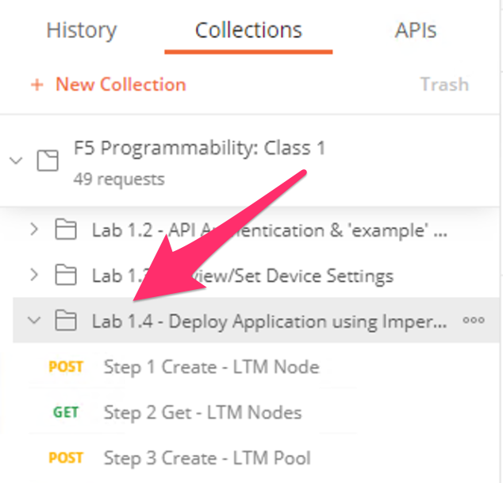
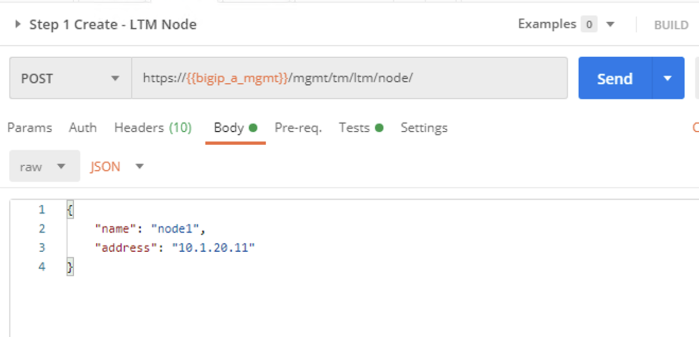
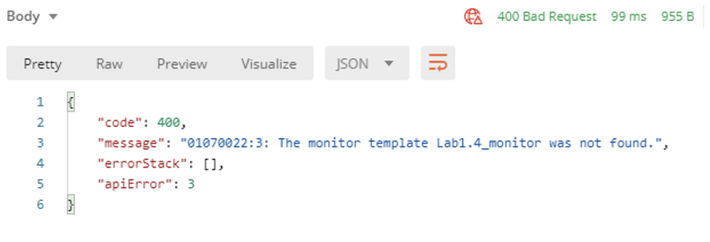
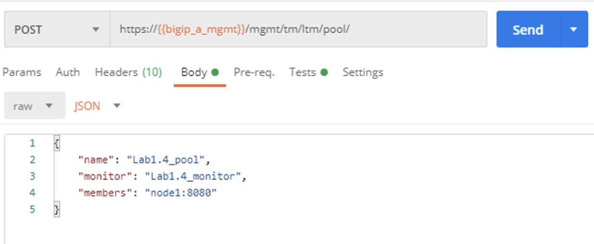
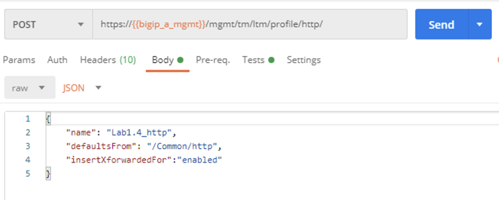
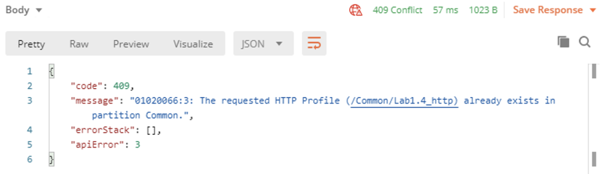
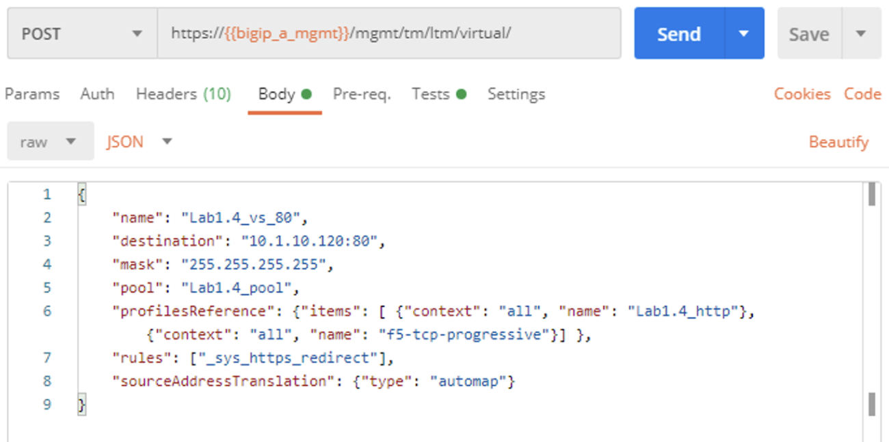

Lab 1.4 - Deploy Application using Imperative API Calls
---------------------------------------------------------

In this lab, we will build a basic LTM Config using the iControlRest API.

Task 1 - Deploy a basic HTTP application Virtual Server and associated components.
~~~~~~~~~~~~~~~~~~~~~~~~~~~~~~

-  Deploy

   -  LTM Node

   -  LTM HTTP Monitor

   -  LTM Pool

   -  LTM HTTP Profile

   -  LTM Virtual Server

Perform the following steps to complete this task:

#. Expand ``Lab 1.4 - Deploy Application using Imperative API Calls`` folder in the Postman collection:

#. Click ``Step 1: Create LTM Node``. Examine the URL and JSON :guilabel:`Body`. We will send a ``POST`` to the ``/mgmt/tm/ltm/node`` endpoint.

   |lab-14-1|

#. Click ``Step 2: Get LTM Node`` request in the folder and click the :guilabel:`Send` button.

   |lab-14-2|

#. Click ``Step 3: Create LTM Monitor``. Examine the URL and JSON :guilabel:`Body`. We will send a ``POST`` to the ``/mgmt/tm/ltm/monitor`` endpoint.

   |lab-14-3|

#. Click ``Step 4: Get LTM Monitor`` request in the folder and click the :guilabel:`Send` button.

   |lab-14-4|

#. Click ``Step 5: Create LTM Pool``. Examine the URL and JSON :guilabel:`Body`. We will send a ``POST`` to the ``/mgmt/tm/ltm/pool`` endpoint.

   |lab-14-5|

#. Click ``Step 6: Get LTM Pool`` request in the folder and click the :guilabel:`Send` button.

   |lab-14-6|

#. Click ``Step 7: Create LTM HTTP Profile (HTTP)``. Examine the URL and JSON :guilabel:`Body`. We will send a ``POST`` to the ``/mgmt/tm/ltm/profile/http/`` endpoint.

   |lab-14-7|

#. Click ``Step 8: Get LTM HTTP Profile (HTTP)`` request in the folder and click the :guilabel:`Send` button.

   |lab-14-8|

#. Click ``Step 9: Create LTM Virtual Server (80)``. Examine the URL and JSON :guilabel:`Body`. We will send a ``POST`` to the ``/mgmt/tm/ltm/virtual`` endpoint.

   |lab-14-9|

#. Click ``Step 10: Get LTM Virtual Server (80)`` request in the folder and click the :guilabel:`Send` button.

   |lab-14-10|

Perform the following steps to save the system configuration before licensing the device:

#. Click the ``Step 11: Save config`` item in the collection. Click the ``Send`` button to save the BIG-IP configuration.

.. |lab-14-4| image:: images/lab-14-4.png

.. |lab-14-9| image:: images/lab-14-9.png
.. |lab-14-10| image:: images/lab-14-10.png
